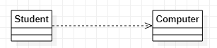
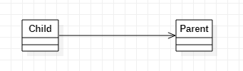
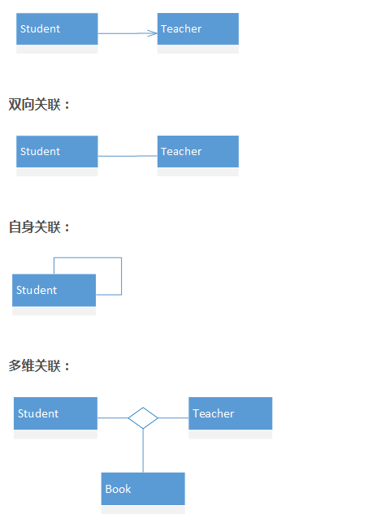

# LearnUML
UML的学习总结

类之间的关系有以下五种，中五种关系的耦合程度依次提高。
- 依赖
- 关联
- 聚合
- 组合
- 泛化


## 依赖
依赖是五种关系中耦合度最小的一种，类的依赖关系使用UML表示如下所示。使用虚线和箭头表示。


```C++
class Computer 
{
public:
	static void work();
}


class Student
{
public:
	void UseComputer()
	{
		//以局部变量的形式
		B* b = new B();
		//以静态函数的形式
		B::work();
		delete b;
	}
}
```

代码中的表现：上图所示类A依赖于类B，这种表现方式表现在类A中以**局部变量，函数形参，返回值，或者是静态函数**等方式来使用类B。

关系的生存周期：依赖关系的生命周期是十分短暂的，通常在函数结束或者是局部变量销毁之后这种关系就会结束。如上图UML所示，**学生需要使用电脑，但是学生不需要一直使用电脑**


## 关联
关联关系和依赖关系类似，关联关系的UML表示如下图所示。读作类Child 关联于类Parent


关联关系相较于依赖关系它的耦合度更高，关联在代码中的表现，如下所示。
```C++
class Parent
{
//...
}

class Child
{
private:
	Parent* p;
}

```
在代码中的表现：在关联关系中类Child会有类Parent的一个引用。
关系的生存周期：由上可知，关联关系的生存周期是当对象销毁之后才结束的，这种关系的周期相比依赖更为持久。就想Parent和Child一直都是母子关系，只有当某一方结束了自己的生命周期后这种关系才结束。

关联关系的种类
- 单向关联
- 双向关联
- 自身关联
- 多维关联



